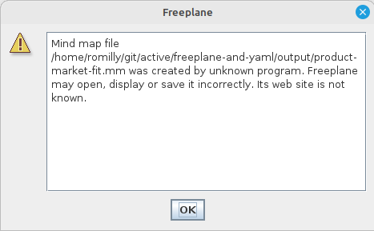

# YAML to Freeplane Converter

A Python tool that converts YAML files into Freeplane mind maps. This allows you to generate mind maps programmatically from structured YAML data.

The YAML file can be created using [Claude AI](https://claude.ai/chat/). 
A suitable prompt is given [below](https://github.com/romilly/freeplane-and-yaml?tab=readme-ov-file#converting-documents-to-yaml-using-claude-ai).

You can read about how it got written using AI on [medium](https://medium.com/@romillyc/build-your-own-mind-map-tools-with-ai-b193564f2464?sk=b353aa7d16d6412e4aae8f3eab0ec554).
That's a _friend link_ so you can read it even if you're not a subscriber.

## Installation

This project requires Python and should be run in a virtual environment:

```bash
# Create and activate virtual environment in the direcoty of your choice
python -m venv venv
source venv/bin/activate  # On Windows use: venv\Scripts\activate
pip install freeplane-and-yaml
```


## Usage

Your YAML file should follow this [schema](https://raw.githubusercontent.com/romilly/freeplane-and-yaml/refs/heads/main/src/schema/mindmap-schema.json). It includes an example.

```json
{
  "$schema": "http://json-schema.org/draft-07/schema#",
  "title": "Mind Map Schema",
  "description": "Schema for Freeplane-compatible mind map YAML format",
  
  "definitions": {
    "node": {
      "type": "object",
      "required": ["title"],
      "properties": {
        "title": {
          "type": "string",
          "description": "The display text for the node"
        },
        "note": {
          "type": "string",
          "description": "Rich text note attached to the node"
        },
        "children": {
          "type": "object",
          "description": "Child nodes of this node",
          "patternProperties": {
            "^[a-zA-Z0-9_]+$": {
              "$ref": "#/definitions/node"
            }
          },
          "additionalProperties": false
        }
      },
      "additionalProperties": false
    }
  },

  "type": "object",
  "required": ["root"],
  "properties": {
    "root": {
      "allOf": [
        { "$ref": "#/definitions/node" },
        { 
          "required": ["children"],
          "description": "The root node must have at least one child"
        }
      ]
    }
  },
  "additionalProperties": false,

  "examples": [
    {
      "root": {
        "title": "Example Mind Map",
        "note": "This is the root node",
        "children": {
          "topic1": {
            "title": "First Topic",
            "note": "Note for first topic",
            "children": {
              "subtopic1": {
                "title": "Subtopic 1",
                "note": "Note for subtopic"
              }
            }
          },
          "topic2": {
            "title": "Second Topic",
            "note": "Note for second topic"
          }
        }
      }
    }
  ]
}

```

### Converting YAML to Mind Map

To convert a YAML file to a Freeplane mind map:

```bash

# Convert YAML and store mind map in temp
convert data/marr.yaml temp
```

### YAML Schema requirements explained

As the schema specifies, The YAML must conform to these rules:
- Must have a root node with a title and at least one child
- Each node requires a title
- Notes are optional
- Child node keys must be alphanumeric (including underscores)
- No additional properties are allowed beyond title, note, and children

For full schema details, see above.

### Converting Documents to YAML using Claude AI

You can use Claude Sonnet to automatically convert documents (PDFs, articles, specifications, etc.) into the required YAML format. Here's the workflow:

1. Share your document and the schema (above) with Claude Sonnet.
2. Use this prompt:
   ```
   I've uploaded a document and a schema file.  I'd like you to summarise the document as a yaml file following the schema that I uploaded.
   ```
3. Claude will generate a YAML file that follows the schema
4. Save Claude's output as a .yaml file
5. Convert it to a mind map using this tool

This workflow is useful for:
- Summarizing academic papers
- Converting product requirements documents (PRDs)
- Creating structured summaries of technical documentation
- Organizing research notes


The generated `.mm` file can be opened in Freeplane. When you first open the file, Freeplane will show this warning dialog because the file wasn't created by Freeplane itself:



This is normal and expected — click OK to load the mind map.

Here's an example of how the output looks:


## Features

- Converts YAML structured data to Freeplane mind map format
- Supports hierarchical node structure
- Includes node titles and optional notes
- Automatically alternates between right and left positions for top-level nodes
- Generates unique IDs for each node
- Validates input against JSON schema

## License

_Apologies to readers from the USA. This README uses UK spelling._

This project is licensed under the MIT Licence — see the [LICENCE](LICENSE) file for details.
